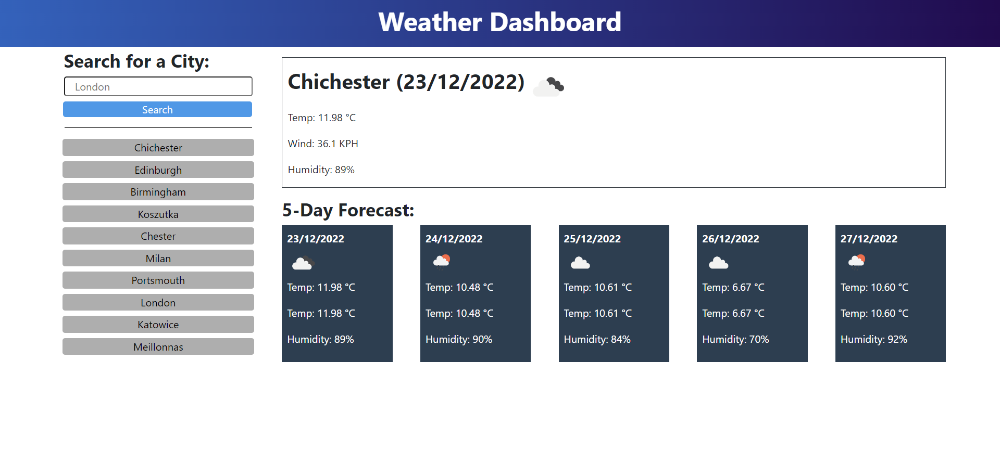

# Weather Dashboard

## Description

This Weather Dashboard will show you todays weather and the forecast for the next five days, including information such as temperature and wind speed.

This project used a combination of HTML, CSS and JavaScript.  It also uses jQuery, Moment.js, BootStrap and the OpenWeatherMap API to get data about the weather.

I needed to keep going over documentation quite frequently, mostly for BootStrap.  I had to keep reminding myself that BootStrap is in use and I don't always need custom CSS, which doesn't always work because of BootStrap anyway, and that I can search the BootStrap documentation to find how to do things.  For example, instead of using custom CSS to add bold font weight to certain text, I can just add the class font-weight-bold to whatever I was trying to make bold.

Features I think that could be added: the user can "pin" or "favurite" the location/s that they search for most frequently in the history buttons so they always stay at the top and maybe get highlighted in a different colour.  A clear history button, maybe the user would like to clear their history, this will remove the saved data in localStorage.  Or maybe the ability to remove a particular button from the history.

This project has made me more confident using jQuery and especially 3rd party API's, I found API's a little confusing to begin with but the more I have used this one, the more my confidence has grown using it.

As I added a feature to load the last searched city on page load, I ran in to a problem when there was nothing saved in localStorage, as it was trying to load a city that didn't exist in storage.  I found a StackOverflow post that helped me with this.  I have put the link to the post in the Credits section.

## Table of Contents

- [Installation](#installation)
- [Usage](#usage)
- [Credits](#credits)
- [License](#license)

##  Installation

This app is available at [Weather Dashboard](https://nick.mbk/github.io/weather-dashboard/)

## Usage

This app is really simple to use, when the page has loaded, type in a city that you want to check the weather for under Search for a City:, and click Search.

The weather for that city will be displayed.  The box at the top on the right side will display todays weather, showing the city, today's date, an icon showing what the weather is like right at this moment, followed by the temperature in degrees celcius, the wind speed in kph and the humidity in percentage.

The 5 day forecast below shows the forecast for the next five days, displaying the same information as todays section.

When you have searched for a city, it will be added to your search history and a button will appear under the search box with that city's name.  You can now simply click the button to search for this city again instead of typing it in again.

The history will store up to ten previous searches, the most recent search will be displayed at the top.

The next time you open the page, it will automatically display the last city you searched.

The page is responsive and will adjust for different size devices.

## Credits

Resources used in this project:

[Bootstrap Documentation](https://getbootstrap.com/docs/4.3/getting-started/introduction/)

[jQuery Documentation](https://api.jquery.com/)

[Moment.js Documentation](https://momentjs.com/docs/)

Used this post to help me find if there was anything stored in localStorage:
[HTML5 localStorage](https://stackoverflow.com/questions/16010827/html5-localstorage-checking-if-a-key-exists)

## License

I used no license for this project.